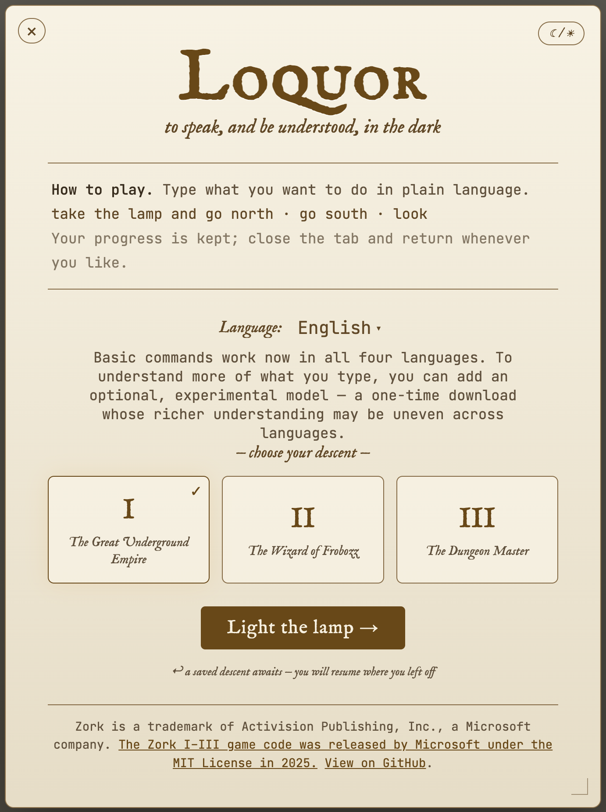

# Loquor

  

> *Loquor* — Latin for "I speak."
> *to speak, and be understood, in the dark.*

**Play Zork in your own words.** Loquor runs **Zork I, II, and III** entirely in
your browser and lets you type what you want to do in plain language — in
**English, French, German, or Spanish** — and turns it into commands the game
understands. **Georgian (ქართული)** is supported too, on Zork I: read the game in
Georgian and type your commands in it, with no AI model required. Pick a game,
play it, and pick up automatically where you left off. The game runs on your
machine; the base experience never phones home.

## Speak, and be understood

Type `coge la lámpara y ve al norte` or `nimm die Lampe und geh nach Norden`, and
Loquor translates it into the canonical Zork command before the dungeon ever sees
it. A built-in, per-language grammar handles the everyday commands **instantly and
offline** — no account, no download, no GPU required.

Want richer understanding of the things you type? Add the **optional AI model**
(WebLLM, via WebGPU): a one-time download that then runs **entirely on your
device**. It's hidden by default — you enable it in Preferences — and an upgrade,
never a gate: pick a language and you're playing immediately, with or without it.
(The AI model covers English, French, German, and Spanish; Georgian runs without
one.)

And Loquor doesn't just understand you — it can **answer in your language**, too.
Output translation renders Zork's replies back into the tongue you chose (rolling
out now, starting with Zork I in French, German, Spanish, and Georgian), so the
whole adventure reads end to end in your own words.

It's built to be played by everyone: full keyboard operation, screen-reader
support, and high-contrast themes are requirements, not afterthoughts.

## Why we can do this — Zork is open source

In November 2025, Microsoft released the original source code for Zork I, II, and
III under the **MIT License** (the `LICENSE` files in the game directories read
*Copyright (c) 2025 Microsoft*). This is what makes Loquor possible: we can ship
the games, read their ZIL source, and derive a command grammar directly from that
source.

- Announcement: [*Preserving code that shaped generations: Zork I, II, and III go open source*](https://opensource.microsoft.com/blog/2025/11/20/preserving-code-that-shaped-generations-zork-i-ii-and-iii-go-open-source/) (Microsoft Open Source Blog, 2025-11-20)

Zork was written by Marc Blank, Dave Lebling, Bruce Daniels, and Tim Anderson and
originally published by Infocom, in **ZIL** (Zork Implementation Language).

## Tech stack

| Component | What it does | License |
|---|---|---|
| [ifvms.js](https://github.com/curiousdannii/ifvms.js) | The Z-machine virtual machine that runs the compiled `.z3` Zork story files in the browser (the engine behind Parchment and Lectrote). | MIT |
| [WebLLM](https://github.com/mlc-ai/web-llm) | Optional in-browser LLM inference (WebGPU) for richer natural-language understanding — a one-time, on-device upgrade over the built-in grammar. | Apache-2.0 |
| [Zork I/II/III source](https://opensource.microsoft.com/blog/2025/11/20/preserving-code-that-shaped-generations-zork-i-ii-and-iii-go-open-source/) | The games themselves — compiled story files we ship, plus ZIL source for grammar extraction. | MIT (© 2025 Microsoft) |
| React + Vite + TypeScript | The application itself, including the multilingual natural-language and output-translation layers. | — |

The natural-language pipeline is **deterministic-first**: per-language lexicons
and a full-vocabulary grammar translate most input on-device, with the optional
LLM as a fallback for the rest. These upstream projects are vendored locally for
reference (and are git-ignored — we never modify them); the application consumes
`ifvms.js` and WebLLM from npm.

### A note on the offline promise

The base game is fully self-hosted — engine, fonts, and story files all ship with
the app, so it plays with no network access and nothing leaves your machine.
There is **one documented exception**: turning on the optional AI model triggers a
one-time, third-party download of the model weights (the disclosed, opt-in
download modal). The model is **off by default** — hidden until you enable it in
Preferences — so a fresh install never reaches that download at all. After the
fetch the model is cached and runs entirely on-device/offline.

## Running locally

    make install     # install dependencies
    make dev         # start the dev server
    make test        # run the test suite
    make all         # lint + format + typecheck + test
    make build       # production build

The three Zork story files live in `public/games/` and the Glk layer is vendored
under `vendor/glkote/` (pinned by commit SHA in `vendor/glkote/PINNED.md`).

`make install` runs `npm ci` (a clean, lockfile-exact install). Use it rather
than a bare `npm install` so the platform-specific native bundler binding (Vite 8
uses Rolldown, which ships per-OS/arch `@rolldown/binding-*` packages) installs
correctly. If you ever see `Error: Cannot find native binding` /
`Cannot find module '@rolldown/binding-...'` — an [npm optional-dependency
bug](https://github.com/npm/cli/issues/4828) that can leave a partial
`node_modules` — fix it with a clean reinstall:

    rm -rf node_modules && npm ci   # (or: make install)

The committed `package-lock.json` already lists every platform's binding, so a
clean `npm ci` resolves the correct one for your machine (macOS, Linux, Windows).

As a safety net, `make dev`, `make build`, and `make preview` run an `ensure-deps`
guard first: if `node_modules` is missing, is older than the lockfile, or can't
load Rolldown's native binding for your platform, they run `npm ci` for you before
starting Vite — so a stale or partial install can't silently crash the dev server.
The binding check asks Node to load Rolldown, so it picks the correct OS/arch/libc
binding automatically (no platform table) and is a silent ~0.1s no-op when healthy.

## Status

Loquor is in active development. The playable engine + custom UI and the
**multilingual natural-language layer** (deterministic grammar with an optional
on-device LLM; English, French, German, and Spanish) are built and under active
refinement. **Georgian (ქართული)** is supported on Zork I — both output and input
— deterministically, with no AI model. **Output translation** — Zork's replies
rendered in your language — is rolling out, starting with Zork I in French,
German, Spanish, and Georgian. Design specs and plans live under
[`docs/superpowers/`](docs/superpowers/); contributor guidance is in
[`CLAUDE.md`](CLAUDE.md).
